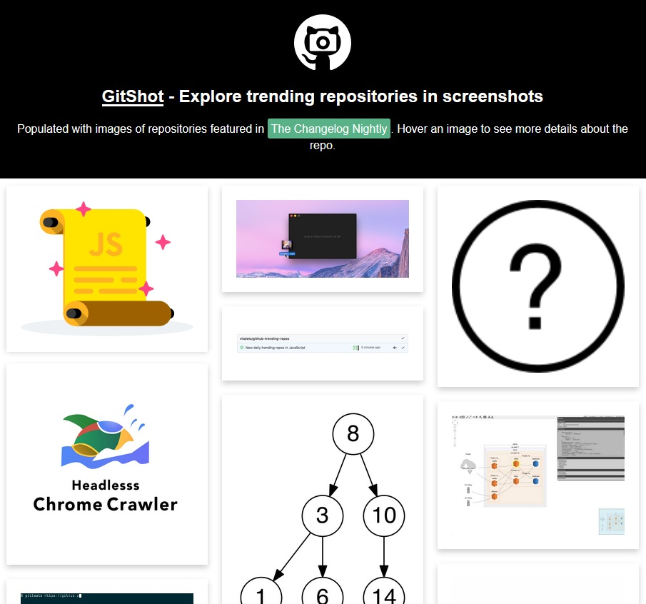

# GitShot - Explore trending GitHub repositories in screenshots

GitShot is a simple react app that shows screenshots of trending GitHub repositories in a masonry gallery.

The list of trending repositories is extracted from the changelog nightly page with an [AWS Lambda function, written in go](https://github.com/quasoft/changelog-nightly-parser).

Screenshots are just images selected from the project's readmes. Images containing the words `screenshot`, `demo` or `example` in their names are preferred. If no such image is found, the first one that is not a *badge* is selected.

The project was created as an experiment for learning React.js and practicing AWS Lambda use.

[Live demo](https://quasoft.github.io/gitshot/)

### Screenshot of GitShot (pun intended):

## Credits
- The Changelog, for putting up [the changelog nightly newsletter](https://changelog.com/nightly), where we take the information about trending GitHub repositories from;
- [christinakayastha](https://github.com/christinakayastha) for the easy to use [react masonry gallery component](https://github.com/christinakayastha/react-image-masonry);
- David Walsh, for the [clean and toughtful CSS flip example](https://davidwalsh.name/css-flip)
- [Icon8](https://icons8.com/) for this [Screenshot icon](https://www.iconfinder.com/icons/2639913/screenshot_icon#size=256).

## Built with [Create React App](https://github.com/facebookincubator/create-react-app)
This project was bootstrapped with [Create React App](https://github.com/facebookincubator/create-react-app).

You can find information on how to perform common tasks with such a react app [here](https://github.com/facebookincubator/create-react-app/blob/master/packages/react-scripts/template/README.md).

